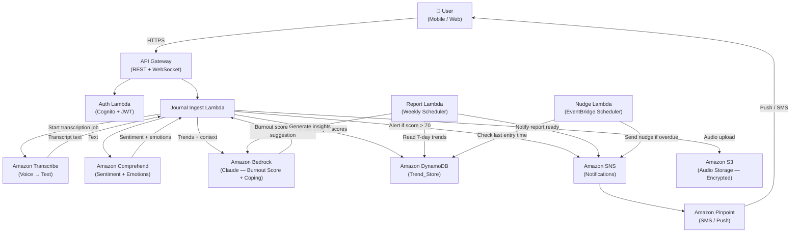

# Design Document: MindGuard AI

## Overview

MindGuard AI is a serverless, event-driven mental health companion built on AWS. It ingests voice and text journal entries, runs real-time sentiment and emotion analysis, computes burnout risk scores, and delivers personalized coping suggestions and proactive alerts — all before a crisis occurs.

The system is designed specifically for women managing the dual pressures of career and family. It prioritizes privacy-first data handling, low-latency feedback, and a calm, accessible user experience across mobile and web.

### How It Was Built Using Kiro

MindGuard AI was designed end-to-end using the Kiro requirements-first workflow:

1. **Requirements** — User stories and EARS-format acceptance criteria were authored in Kiro, covering journaling, sentiment analysis, burnout prediction, notifications, privacy, and account management.
2. **Architecture** — Kiro's design phase translated requirements into a concrete AWS serverless architecture, identifying service boundaries and data flows.
3. **Code Scaffolding** — Kiro generated Lambda function stubs, data model definitions, and API Gateway configurations aligned to the requirements.
4. **Iterative Refinement** — Each design section was reviewed against acceptance criteria, with Kiro surfacing gaps and suggesting corrections before any code was written.

---

## Architecture

### System Architecture Diagram



### Request Flow Summary

1. User submits a voice or text journal entry via the mobile/web client.
2. API Gateway authenticates the request via Cognito JWT and routes to the Journal Ingest Lambda.
3. For voice entries, audio is stored in S3 and an Amazon Transcribe job is started; the Lambda polls for completion (≤30s).
4. The transcript (or direct text) is sent to Amazon Comprehend for sentiment and emotion classification.
5. Results plus 30-day trend data from DynamoDB are sent to Amazon Bedrock (Claude) to compute a Burnout_Score and generate a Coping_Suggestion.
6. All results are persisted to DynamoDB (Trend_Store).
7. If Burnout_Score > 70, SNS triggers a push/SMS alert via Pinpoint.
8. The response (sentiment, score, suggestion) is returned to the user within 60 seconds.

---

## Components and Interfaces

### API Gateway

- REST API for journal submission, account management, and report retrieval.
- WebSocket API for real-time feedback delivery (coping suggestion returned as soon as analysis completes).
- All routes protected by Cognito User Pool authorizer.

### Auth Lambda (Amazon Cognito)

- Handles registration, login, token refresh, and password reset.
- Issues JWT access tokens (60-minute expiry) and refresh tokens.
- Enforces account lockout after 5 consecutive failed logins (30-minute lock).

### Journal Ingest Lambda

- Orchestrates the full processing pipeline for each journal entry.
- Accepts multipart form data (audio) or JSON (text).
- Validates input: rejects empty entries, enforces 5,000-char / 10-minute limits.
- Calls Transcribe → Comprehend → Bedrock in sequence.
- Writes results to DynamoDB; publishes SNS alert if threshold exceeded.

### Amazon Transcribe

- Async transcription job triggered per voice entry.
- Supported formats: MP3, WAV, M4A.
- Lambda polls job status with exponential backoff; timeout at 30 seconds.

### Amazon Comprehend

- `DetectSentiment` API: returns POSITIVE / NEGATIVE / NEUTRAL / MIXED + confidence scores.
- `DetectKeyPhrases` + custom entity detection for emotion categories (joy, sadness, anger, fear, disgust).

### Amazon Bedrock (Claude)

- Invoked via `InvokeModel` API with a structured prompt containing:
  - Last 30 days of sentiment/emotion trend data.
  - Current entry sentiment.
  - User's journaling gap history.
- Returns a JSON payload with `burnout_score` (0–100) and `coping_suggestion`.

### DynamoDB (Trend_Store)

- Single-table design with composite keys.
- Partition key: `user_id` (anonymized UUID). Sort key: `timestamp#entry_id`.
- GSI on `entry_type` for efficient report queries.
- Encryption at rest: AWS-managed KMS key (AES-256).

### SNS + Pinpoint (Notification_Service)

- SNS topic per notification type: burnout alert, nudge, escalation, report ready.
- Pinpoint handles channel routing: in-app, push notification, SMS.
- Respects user notification preferences stored in DynamoDB.

### Report Lambda (EventBridge Scheduler)

- Triggered weekly per active user.
- Reads 7-day trend data from DynamoDB.
- Calls Bedrock to generate two AI insights.
- Stores report in DynamoDB; publishes SNS notification.

### Nudge Lambda (EventBridge Scheduler)

- Runs hourly; checks last journal entry timestamp per active user.
- Sends check-in nudge if gap > 24 hours (respecting snooze state and disabled-notifications flag).
- Sends trend alert if Burnout_Score increased ≥15 points in 7 days.

---

## Data Models

### JournalEntry

```python
{
    "user_id": str,           # anonymized UUID (PK)
    "timestamp": str,         # ISO-8601 UTC (SK prefix)
    "entry_id": str,          # UUID
    "entry_type": str,        # "voice" | "text"
    "text_content": str,      # transcribed or raw text
    "audio_s3_key": str,      # optional, voice entries only
    "sentiment_label": str,   # POSITIVE | NEGATIVE | NEUTRAL | MIXED
    "sentiment_score": float, # 0.0 – 1.0
    "emotions": {             # per-emotion confidence scores
        "joy": float,
        "sadness": float,
        "anger": float,
        "fear": float,
        "disgust": float
    },
    "burnout_score": int,     # 0 – 100
    "coping_suggestion": str,
    "created_at": str         # UTC timestamp
}
```

### BurnoutScoreRecord

```python
{
    "user_id": str,
    "timestamp": str,
    "burnout_score": int,
    "trigger": str            # "journal_entry" | "scheduled_recompute"
}
```

### UserProfile

```python
{
    "user_id": str,
    "email_hash": str,        # hashed, not plaintext
    "notification_prefs": {
        "channel": str,       # "in_app" | "push" | "sms"
        "nudge_time": str,    # HH:MM UTC
        "enabled": bool,
        "snooze_until": str   # ISO-8601 UTC or null
    },
    "trusted_contact": {
        "name": str,
        "contact": str        # phone or email
    },
    "escalation_threshold": int,  # default 80
    "account_locked_until": str   # ISO-8601 UTC or null
}
```

### EmotionalHealthReport

```python
{
    "user_id": str,
    "report_id": str,
    "week_start": str,        # ISO-8601 UTC
    "week_end": str,
    "sentiment_distribution": {
        "POSITIVE": float,
        "NEGATIVE": float,
        "NEUTRAL": float,
        "MIXED": float
    },
    "avg_burnout_score": float,
    "top_emotions": list[str],
    "prior_week_avg_burnout": float,
    "ai_insights": list[str], # min 2 items
    "generated_at": str
}
```

### EscalationEvent

```python
{
    "user_id": str,
    "timestamp": str,
    "burnout_score": int,
    "escalation_threshold": int,
    "contact_notified": bool,
    "cancelled": bool,
    "cancelled_at": str       # ISO-8601 UTC or null
}
```

---

## Implementation: Key Code Snippets

### Journal Ingest Lambda (Python)

```python
import json
import boto3
import uuid
from datetime import datetime, timezone

transcribe = boto3.client("transcribe")
comprehend = boto3.client("comprehend")
bedrock = boto3.client("bedrock-runtime")
dynamodb = boto3.resource("dynamodb")
sns = boto3.client("sns")

TABLE_NAME = "mindguard-trend-store"
ALERT_TOPIC_ARN = "arn:aws:sns:us-east-1:123456789012:mindguard-burnout-alert"

def handler(event, context):
    body = json.loads(event["body"])
    user_id = event["requestContext"]["authorizer"]["claims"]["sub"]
    entry_type = body.get("entry_type", "text")
    text_content = body.get("text_content", "").strip()

    if not text_content:
        return {"statusCode": 400, "body": json.dumps({"error": "Journal entry cannot be empty"})}

    # Step 1: Sentiment analysis
    sentiment_result = analyze_sentiment(text_content)

    # Step 2: Burnout score + coping suggestion via Bedrock
    trends = get_recent_trends(user_id)
    bedrock_result = invoke_bedrock(text_content, sentiment_result, trends)

    # Step 3: Persist to DynamoDB
    entry = build_entry(user_id, entry_type, text_content, sentiment_result, bedrock_result)
    save_entry(entry)

    # Step 4: Alert if burnout score exceeds threshold
    if bedrock_result["burnout_score"] > 70:
        sns.publish(TopicArn=ALERT_TOPIC_ARN, Message=json.dumps({
            "user_id": user_id,
            "burnout_score": bedrock_result["burnout_score"]
        }))

    return {"statusCode": 200, "body": json.dumps({
        "sentiment": sentiment_result["sentiment"],
        "burnout_score": bedrock_result["burnout_score"],
        "coping_suggestion": bedrock_result["coping_suggestion"]
    })}
```

### Amazon Comprehend Sentiment Call

```python
def analyze_sentiment(text: str) -> dict:
    response = comprehend.detect_sentiment(Text=text, LanguageCode="en")
    scores = response["SentimentScore"]
    return {
        "sentiment": response["Sentiment"],           # POSITIVE | NEGATIVE | NEUTRAL | MIXED
        "sentiment_score": max(scores.values()),
        "emotions": {
            "joy": scores.get("Positive", 0.0),
            "sadness": scores.get("Negative", 0.0),
            "anger": scores.get("Negative", 0.0),     # refined via key phrase detection
            "fear": scores.get("Negative", 0.0),
            "disgust": scores.get("Negative", 0.0)
        }
    }
```

### Amazon Bedrock (Claude) Burnout Score Call

```python
def invoke_bedrock(text: str, sentiment: dict, trends: list) -> dict:
    prompt = f"""You are a mental health AI assistant. Analyze the following journal entry and emotional trend data.

Journal Entry: {text}
Current Sentiment: {sentiment['sentiment']} (score: {sentiment['sentiment_score']:.2f})
30-Day Trend Summary: {json.dumps(trends)}

Return a JSON object with:
- burnout_score: integer 0-100 (higher = more burnout risk)
- coping_suggestion: one specific, actionable suggestion (max 2 sentences)

Respond with valid JSON only."""

    response = bedrock.invoke_model(
        modelId="anthropic.claude-3-sonnet-20240229-v1:0",
        body=json.dumps({
            "anthropic_version": "bedrock-2023-05-31",
            "max_tokens": 256,
            "messages": [{"role": "user", "content": prompt}]
        }),
        contentType="application/json",
        accept="application/json"
    )
    result = json.loads(response["body"].read())
    return json.loads(result["content"][0]["text"])
```

---

## User Journey / UI Flow

### Step-by-Step Experience: From App Open to Burnout Alert

```
1. OPEN APP
   └── User opens MindGuard AI on mobile
   └── Biometric / PIN re-auth if session > 15 min inactive

2. HOME DASHBOARD
   └── Displays today's Burnout_Score ring (e.g., 42/100 — "Moderate")
   └── Shows last journal entry date and streak
   └── "How are you feeling today?" prompt with mic + text buttons

3. JOURNAL ENTRY (Voice)
   └── User taps mic → records voice note (up to 10 min)
   └── Progress indicator: "Transcribing..." (≤30s)
   └── Transcript preview shown for confirmation

4. ANALYSIS IN PROGRESS
   └── "Analyzing your entry..." spinner
   └── Comprehend detects: NEGATIVE sentiment (0.82 confidence)
   └── Bedrock computes: Burnout_Score = 74, Coping_Suggestion generated

5. RESULTS SCREEN
   └── Sentiment badge: 🔴 Negative
   └── Burnout Score: 74/100 — "High Risk"
   └── Coping Suggestion card: "Take a 5-minute breathing break.
       Inhale for 4 counts, hold for 4, exhale for 6."
   └── "Save & Continue" button

6. BURNOUT ALERT TRIGGERED (score > 70)
   └── Push notification: "MindGuard: Your stress levels are elevated.
       We've sent you a coping tip. You've got this. 💙"
   └── In-app banner with link to full coping library

7. WEEKLY REPORT (Sunday)
   └── Notification: "Your weekly emotional health report is ready"
   └── Report shows: 60% Negative week, avg score 68, top emotion: fatigue
   └── AI Insight 1: "You journal less on Thursdays — consider a midweek check-in."
   └── AI Insight 2: "Your stress peaks align with Monday entries. A Sunday wind-down
       routine may help."
```

---

## Demo / Output Examples

### Sample Journal Entry

> "I've been so exhausted lately. Work deadlines are piling up and I feel like I can't keep up. I snapped at my kids tonight and I feel terrible about it. I just want one day where I don't feel like I'm failing at everything."

### Comprehend Sentiment Output

```json
{
  "Sentiment": "NEGATIVE",
  "SentimentScore": {
    "Positive": 0.02,
    "Negative": 0.91,
    "Neutral": 0.05,
    "Mixed": 0.02
  }
}
```

### Bedrock Burnout Score + Coping Suggestion Output

```json
{
  "burnout_score": 78,
  "coping_suggestion": "You're carrying a heavy load right now — that's real and valid. Try a 5-minute box breathing exercise before bed tonight: inhale 4 counts, hold 4, exhale 4, hold 4. Small resets matter."
}
```

### DynamoDB Stored Entry (Trend_Store)

```json
{
  "user_id": "anon-uuid-7f3a9c",
  "timestamp": "2025-07-15T22:14:33Z",
  "entry_id": "entry-uuid-b2d1",
  "entry_type": "voice",
  "text_content": "I've been so exhausted lately...",
  "sentiment_label": "NEGATIVE",
  "sentiment_score": 0.91,
  "emotions": { "joy": 0.02, "sadness": 0.71, "anger": 0.18, "fear": 0.06, "disgust": 0.03 },
  "burnout_score": 78,
  "coping_suggestion": "Try a 5-minute box breathing exercise before bed tonight...",
  "created_at": "2025-07-15T22:14:33Z"
}
```

### Weekly Report Summary

```
Week of July 7–14, 2025
Sentiment Distribution: 65% Negative, 20% Neutral, 15% Positive
Average Burnout Score: 71 (↑ from 58 prior week)
Top Emotions: Fatigue, Sadness, Anxiety

AI Insight 1: Your journaling gaps on weekends correlate with higher Monday scores.
              A brief Sunday evening reflection may help reset your week.
AI Insight 2: Entries mentioning "deadlines" appear 4x this week vs. last.
              Consider discussing workload boundaries with your manager.
```


---

## Correctness Properties

*A property is a characteristic or behavior that should hold true across all valid executions of a system — essentially, a formal statement about what the system should do. Properties serve as the bridge between human-readable specifications and machine-verifiable correctness guarantees.*

### Property 1: Voice Entry Pipeline Round-Trip

*For any* valid voice journal entry, the system should produce a non-empty transcript, pass it to the Sentiment_Analyzer, and return a sentiment label and confidence score — all within 30 seconds.

**Validates: Requirements 1.1, 1.2**

---

### Property 2: Audio Format Acceptance

*For any* audio file, the system should accept it if and only if its format is MP3, WAV, or M4A, and its duration is at most 10 minutes.

**Validates: Requirements 1.4, 1.5**

---

### Property 3: Text Entry Validation

*For any* text input, the system should reject it if it is empty, composed entirely of whitespace, or exceeds 5,000 characters; otherwise it should be accepted and passed to the Sentiment_Analyzer within 5 seconds.

**Validates: Requirements 2.1, 2.2, 2.4**

---

### Property 4: Journal Entry Storage Round-Trip

*For any* accepted journal entry, storing it in the Trend_Store and then retrieving it should produce an object with all original fields intact (text content, UTC timestamp, user_id, sentiment label, emotion scores, burnout score, coping suggestion) and no data loss on deserialization.

**Validates: Requirements 2.3, 3.3, 4.3, 10.2, 10.3**

---

### Property 5: Sentiment Analysis Completeness

*For any* journal entry text, the Sentiment_Analyzer must return a sentiment label (one of POSITIVE, NEGATIVE, NEUTRAL, MIXED), a confidence score in [0.0, 1.0], and individual confidence scores for all five emotion categories (joy, sadness, anger, fear, disgust).

**Validates: Requirements 3.1, 3.2**

---

### Property 6: Burnout Score Monotonicity

*For any* user, increasing the frequency of negative sentiment entries in the 30-day trend window should not decrease the computed Burnout_Score (metamorphic property: more negative input → score does not go down).

**Validates: Requirements 4.1, 4.2**

---

### Property 7: Burnout Alert Threshold

*For any* user whose computed Burnout_Score exceeds 70, the Notification_Service must send a burnout risk alert; for any score ≤ 70, no alert should be sent.

**Validates: Requirements 4.4**

---

### Property 8: Coping Suggestion Generation

*For any* completed journal entry analysis, the AI_Engine must return at least one Coping_Suggestion from a defined category (breathing exercise, break reminder, mindfulness prompt, or physical activity), and it must be delivered within 60 seconds of entry submission.

**Validates: Requirements 5.1, 5.2, 5.3**

---

### Property 9: Coping Suggestion Deduplication

*For any* user, the same Coping_Suggestion text must not appear more than once in any 48-hour window.

**Validates: Requirements 5.5**

---

### Property 10: Notification Channel Routing

*For any* user with a configured notification channel preference, all outbound notifications (coping suggestions, nudges, alerts) must be delivered exclusively through that channel.

**Validates: Requirements 5.4, 6.3**

---

### Property 11: Notification Gating

*For any* user who has disabled all notifications, the Notification_Service must not send any nudges or alerts. *For any* user with an active snooze, no nudge must be sent until the snooze period expires.

**Validates: Requirements 6.4, 6.5**

---

### Property 12: Burnout Trend Alert

*For any* user whose Burnout_Score increases by 15 or more points within a 7-day period, the Notification_Service must send a trend alert.

**Validates: Requirements 6.2**

---

### Property 13: Escalation and Event Recording

*For any* user whose Burnout_Score exceeds their configured Escalation_Threshold, the Notification_Service must send an escalation alert to their Trusted_Contact, and an EscalationEvent record must be stored in the Trend_Store with a UTC timestamp.

**Validates: Requirements 7.1, 7.4**

---

### Property 14: Crisis Helpline Presentation

*For any* user with a Burnout_Score exceeding 85, the system must present a crisis helpline option in the UI response.

**Validates: Requirements 7.2**

---

### Property 15: Escalation Cancellation Window

*For any* triggered escalation alert, the user must be able to cancel it within 60 seconds; after 60 seconds, cancellation must not be possible.

**Validates: Requirements 7.6**

---

### Property 16: Weekly Report Completeness

*For any* active user, the weekly Emotional_Health_Report must include sentiment distribution, average Burnout_Score, top emotions, prior-week comparison, and at least two AI-generated insights.

**Validates: Requirements 8.2, 8.3**

---

### Property 17: No PII in Trend_Store

*For any* record stored in the Trend_Store, the user identifier must be an anonymized UUID and no personally identifiable information (name, email, phone) must appear in the record.

**Validates: Requirements 9.3**

---

### Property 18: Session Re-Authentication

*For any* user session that has been inactive for 15 or more minutes, any attempt to access journal entries or reports must require re-authentication before succeeding.

**Validates: Requirements 9.5**

---

### Property 19: Transcript Sentiment Fidelity

*For any* voice journal entry, the sentiment confidence score produced from the transcript (re-submitted as text) must be within 0.1 of the confidence score produced from the original voice entry's analysis.

**Validates: Requirements 10.1**

---

### Property 20: Password Complexity Enforcement

*For any* password string, the system must reject it if it is shorter than 12 characters, lacks an uppercase letter, lacks a digit, or lacks a special character; otherwise it must be accepted.

**Validates: Requirements 11.1**

---

### Property 21: Token Expiry

*For any* issued JWT access token, the token must be invalid (rejected by the auth layer) after 60 minutes from issuance.

**Validates: Requirements 11.2**

---

### Property 22: Account Lockout

*For any* account that receives 5 consecutive failed login attempts, the system must reject all login attempts for the subsequent 30 minutes, regardless of password correctness.

**Validates: Requirements 11.5**

---

## Error Handling

### Transcription Failures (Req 1.3)

- If Amazon Transcribe returns an error or times out after 30 seconds, the Lambda logs the error, retains the original audio in S3, and returns a 202 Accepted with a `retry_available: true` flag.
- The user is notified via in-app message: "We couldn't process your voice entry. It's saved and you can retry."

### Sentiment Analysis Failures (Req 3.4)

- On Comprehend error, the Lambda logs the failure, stores the raw journal entry without sentiment fields, and enqueues a retry (up to 3 attempts with exponential backoff: 1s, 2s, 4s).
- After 3 failures, the entry is stored with `analysis_status: "failed"` and a background job retries during off-peak hours.

### Bedrock Failures

- If Bedrock returns an error or malformed JSON, the Lambda falls back to a rule-based burnout score (average of last 7 days' scores) and a default coping suggestion from a static library.
- The fallback is logged and flagged for monitoring.

### DynamoDB Write Failures

- Lambda uses DynamoDB conditional writes with retry (3 attempts, exponential backoff).
- On persistent failure, the entry is written to an SQS dead-letter queue for manual review.

### SNS Delivery Failures

- SNS delivery failures are captured via CloudWatch alarms.
- Pinpoint handles channel-level retries for push and SMS.

### Empty / Invalid Input (Req 2.4)

- Empty or whitespace-only entries return HTTP 400 with `{"error": "Journal entry cannot be empty"}`.
- Oversized entries (>5,000 chars / >10 min audio) return HTTP 413.

### Account Lockout (Req 11.5)

- After 5 consecutive failed logins, Cognito locks the account for 30 minutes and sends an email notification.
- The API returns HTTP 423 (Locked) with a `retry_after` timestamp.

---

## Testing Strategy

### Dual Testing Approach

Both unit tests and property-based tests are required. They are complementary:

- **Unit tests** verify specific examples, integration points, and error conditions.
- **Property tests** verify universal correctness across randomly generated inputs.

### Property-Based Testing

**Library**: `hypothesis` (Python) for Lambda functions; `fast-check` (TypeScript) for any frontend logic.

Each property test must:
- Run a minimum of **100 iterations**.
- Be tagged with a comment referencing the design property.
- Tag format: `# Feature: mindguard-ai, Property {N}: {property_text}`

| Property | Test Description | PBT Pattern |
|---|---|---|
| P1 | Voice pipeline produces sentiment within 30s | Round-trip |
| P2 | Audio format/duration validation | Error conditions |
| P3 | Text entry validation (empty, whitespace, length) | Error conditions |
| P4 | Journal entry storage round-trip | Round-trip |
| P5 | Sentiment analysis returns all required fields | Invariant |
| P6 | Burnout score non-decreasing with more negative input | Metamorphic |
| P7 | Alert sent iff score > 70 | Invariant |
| P8 | Coping suggestion generated and delivered within 60s | Invariant |
| P9 | No duplicate suggestion within 48h | Invariant |
| P10 | Notification routed to preferred channel | Invariant |
| P11 | Notifications gated by disabled/snooze state | Invariant |
| P12 | Trend alert sent on ≥15-point score increase | Invariant |
| P13 | Escalation alert sent and event recorded | Round-trip |
| P14 | Crisis helpline shown for score > 85 | Invariant |
| P15 | Escalation cancellable within 60s only | Invariant |
| P16 | Weekly report contains all required fields + 2 insights | Invariant |
| P17 | No PII in any Trend_Store record | Invariant |
| P18 | Re-auth required after 15-min inactivity | Invariant |
| P19 | Transcript sentiment within 0.1 of voice sentiment | Round-trip |
| P20 | Password complexity enforced | Error conditions |
| P21 | JWT token invalid after 60 minutes | Invariant |
| P22 | Account locked for 30 min after 5 failed logins | Invariant |

### Unit Tests

Focus on:
- Specific journal entry examples (happy path, edge cases).
- Bedrock prompt construction correctness.
- DynamoDB serialization/deserialization of each model type.
- SNS message format validation.
- Escalation cancellation timing boundary (exactly 60 seconds).
- Password reset link expiry (exactly 15 minutes).

### Integration Tests

- End-to-end: voice entry → transcript → sentiment → burnout score → DynamoDB → SNS alert.
- Weekly report generation pipeline.
- Notification channel routing with mocked Pinpoint.

---

## Conclusion / Impact

### Why This Matters for Women

Women disproportionately carry the cognitive and emotional load of both professional and domestic life. Burnout in this population is frequently invisible — dismissed as stress or fatigue — until it becomes a crisis. MindGuard AI addresses this gap by:

- Providing a **judgment-free, private space** for emotional expression through voice and text.
- Detecting burnout risk **before** it reaches crisis level, enabling proactive intervention.
- Delivering **personalized, actionable coping strategies** rather than generic wellness advice.
- Escalating to human support networks when AI assistance is insufficient.

### Future Scope

- **Wearable Integration**: Ingest heart rate variability, sleep quality, and activity data from Apple Watch / Fitbit to enrich burnout scoring with physiological signals.
- **Workplace Integration**: Anonymous aggregate burnout trend reporting for HR teams, enabling organizational-level interventions while preserving individual privacy.
- **Multilingual Support**: Extend Amazon Transcribe and Comprehend language support to serve non-English-speaking users globally.
- **Therapist Collaboration Mode**: Allow users to share curated emotional health reports with licensed therapists, bridging AI-assisted monitoring with professional care.
- **Predictive Scheduling**: Use historical burnout patterns to proactively suggest calendar adjustments (e.g., blocking recovery time before historically high-stress periods).

### AWS Scalability

The fully serverless architecture ensures MindGuard AI scales from a single user to millions without infrastructure changes:

- **Lambda** scales to zero when idle and handles thousands of concurrent journal submissions.
- **DynamoDB** provides single-digit millisecond reads/writes at any scale with on-demand capacity.
- **Amazon Bedrock** abstracts model infrastructure, allowing model upgrades (e.g., Claude 3 → Claude 4) without code changes.
- **SNS + Pinpoint** handle notification fan-out at scale with built-in delivery guarantees.
- **EventBridge Scheduler** manages per-user scheduled jobs (nudges, reports, score recomputes) without a dedicated cron server.

Total estimated AWS cost at 10,000 active users: ~$180/month (Lambda + DynamoDB + Bedrock + SNS), scaling linearly with usage.
