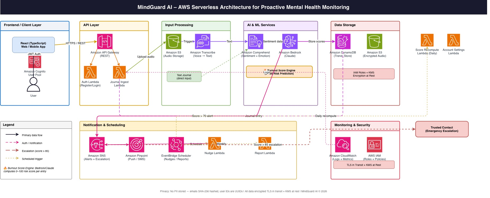

# MindGuard AI

A serverless, proactive mental health and burnout prevention companion for women navigating career and family pressures. MindGuard AI continuously monitors emotional patterns through voice and text journaling, applies AI-driven sentiment analysis, and delivers personalized coping strategies and proactive burnout alerts — before a crisis occurs.

---

## Features

- **Voice & Text Journaling** — Submit journal entries via voice (MP3, WAV, M4A, up to 10 min) or text (up to 5,000 chars); voice entries are transcribed via Amazon Transcribe within 30 seconds
- **Real-Time Sentiment Analysis** — Amazon Comprehend detects sentiment and emotion (joy, sadness, anger, fear, disgust) from every entry
- **Burnout Scoring** — Amazon Bedrock (Claude) computes a burnout score (0–100) and generates personalized coping suggestions within 60 seconds of submission
- **Smart Nudges & Alerts** — Proactive push/SMS notifications via Amazon SNS + Pinpoint; burnout score > 70 triggers an alert, > 85 presents crisis helpline resources
- **Emergency Escalation** — Notifies a user-configured trusted contact when burnout score exceeds the user's escalation threshold (default: 80); cancellable within 60 seconds
- **Weekly Emotional Health Reports** — AI-generated summaries of emotional trends and insights
- **Privacy-First** — No PII stored in the Trend_Store; emails are SHA-256 hashed, user identifiers are anonymized UUIDs; audio stored encrypted in S3

---

## Architecture

```
API Gateway (REST + WebSocket)
        │
        ▼
  Amazon Cognito ──── JWT Auth
        │
        ▼
  Lambda Functions
  ├── auth_lambda              Register, login, token refresh, password reset
  ├── journal_ingest_lambda    Voice/text entry pipeline orchestrator
  ├── nudge_lambda             EventBridge-triggered nudge/trend alert sender
  ├── report_lambda            Weekly emotional health report generator
  ├── score_recompute_lambda   Scheduled daily burnout score recompute
  └── account_settings_lambda  Notification prefs, trusted contact, escalation threshold
        │
        ├── Amazon Transcribe   (voice → text)
        ├── Amazon Comprehend   (sentiment + emotion analysis)
        ├── Amazon Bedrock      (burnout scoring + coping suggestions)
        ├── Amazon DynamoDB     (Trend_Store — single-table design)
        ├── Amazon S3           (encrypted audio storage)
        ├── Amazon SNS/Pinpoint (notifications)
        └── EventBridge Scheduler (nudges, reports, score recomputes)
```

---

## Project Structure

```
mindguard-ai/
├── src/
│   ├── lambdas/
│   │   ├── auth_lambda.py
│   │   ├── journal_ingest_lambda.py
│   │   ├── nudge_lambda.py
│   │   ├── report_lambda.py
│   │   ├── score_recompute_lambda.py
│   │   └── account_settings_lambda.py
│   ├── models/
│   │   └── models.py
│   └── utils/
│       ├── bedrock.py
│       ├── dynamodb.py
│       ├── notifications.py
│       └── sentiment.py
├── tests/
│   ├── test_<module>_unit.py
│   ├── test_<module>_property.py
│   └── test_pipeline_integration.py
└── requirements.txt
```

---

## Getting Started

### Prerequisites

- Python 3.x
- AWS account with the required services enabled
- AWS credentials configured (`~/.aws/credentials` or environment variables)

### Install Dependencies

```bash
pip install -r requirements.txt
```

### Required Environment Variables

| Variable | Description |
|---|---|
| `AWS_DEFAULT_REGION` | AWS region (e.g. `us-east-1`) |
| `AWS_ACCESS_KEY_ID` | AWS access key |
| `AWS_SECRET_ACCESS_KEY` | AWS secret key |
| `DYNAMODB_TABLE` | DynamoDB table name (e.g. `mindguard-trend-store`) |
| `COGNITO_USER_POOL_ID` | Cognito User Pool ID |
| `COGNITO_CLIENT_ID` | Cognito App Client ID |
| `AUDIO_S3_BUCKET` | S3 bucket for encrypted audio storage |
| `LOCKOUT_SNS_TOPIC_ARN` | SNS topic ARN for account lockout notifications (optional) |

---

## Running Tests

```bash
# Run all tests (single pass)
pytest tests/

# Run with coverage report
pytest tests/ --cov=src --cov-report=term-missing

# Run a specific test file
pytest tests/test_auth_unit.py

# Run property-based tests only
pytest tests/ -k "property"

# Run unit tests only
pytest tests/ -k "unit"
```

### Testing Conventions

- Every module has two test files: `test_<module>_unit.py` (example-based) and `test_<module>_property.py` (property-based)
- Property tests use [Hypothesis](https://hypothesis.readthedocs.io/) with `@given` + `@settings(max_examples=100)` minimum
- AWS calls are mocked with [moto](https://docs.getmoto.org/) using the `@mock_aws` decorator
- Set fake AWS credentials via `os.environ` before importing source modules in tests

---

## Key Business Rules

- Burnout score > 70 → push/SMS alert
- Burnout score > 85 → crisis helpline presented in response
- Burnout score > user's `escalation_threshold` (default 80) → trusted contact notified
- Escalation cancellable within 60 seconds of triggering
- Same coping suggestion must not repeat within a 48-hour window
- Users with notifications disabled never receive nudges or alerts
- Account locked for 30 minutes after 5 consecutive failed login attempts

---

## Privacy & Security

- No PII stored in DynamoDB — emails are SHA-256 hashed, user IDs are UUIDs
- Audio files stored with AES-256 server-side encryption in S3
- JWT access tokens expire after 60 minutes
- Password requirements: minimum 12 characters, at least one uppercase letter, one digit, and one special character
